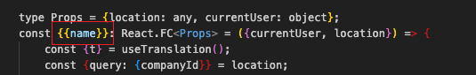
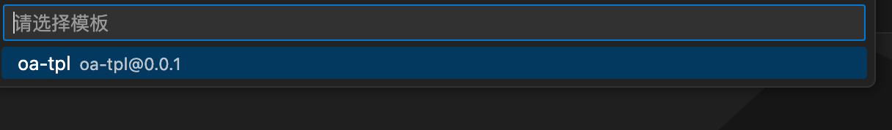

# templates

franky templates

# usage

0. fork 仓库,npm install 一下
1. 在 tpls 文件夹内新建模板文件夹(参考 tpls/oa-tpl)
2. 如果需要插入参数,需要在文件扩展名后添加.hbs,并在对应位置使用{{}}将参数包起来,目前只插入了 name(组件名称)
3. hbs 文件会插入参数,package.json 会忽略,其他文件会直接复制
   
4. 内部新建 package.json,补充下相应信息,具体展示为 
5. 所有文件新建完后执行 npm run cz,手机 commit 信息
6. 提交 pr,等待合并
